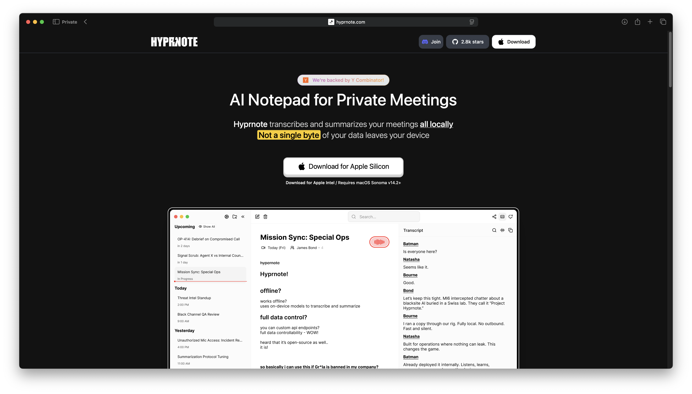
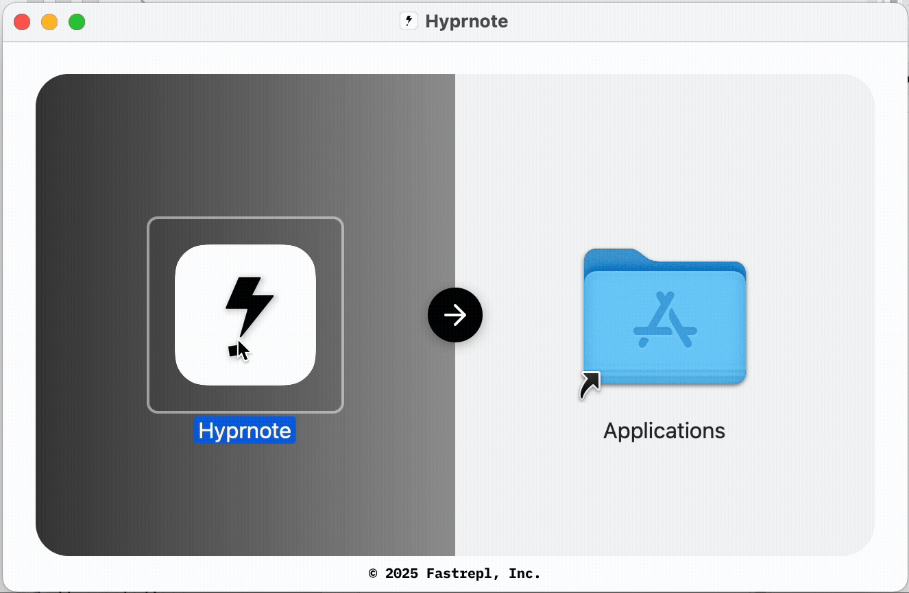

# Getting Started

## 1. Download the desktop app

Currently, the macOS app is only available. Windows will be released in August of 2025.

You might wonder... what about Linux?

I just want to tell you, [you are not alone](https://github.com/fastrepl/hyprnote/issues/67).

<figure><figcaption>
Click on the "Download" button
</figcaption></figure>

## 2. Open DMG file and drag Hyprnote app to Applications

<figure><figcaption>
It's easy as do-re-mi
</figcaption></figure>

## 3. Start or end by pressing the red button!

Press the red button to start listening to sounds coming in/out of your computer. After your meeting is over, press the stop button and Hyprnote will craft you a personalized summary.

<figure><figcaption>
Asking for consent matters a lot
</figcaption></figure>

